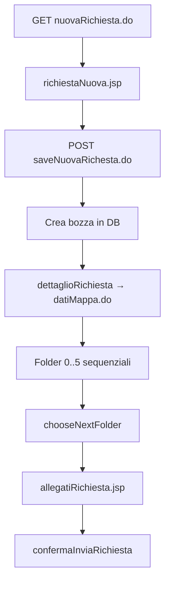
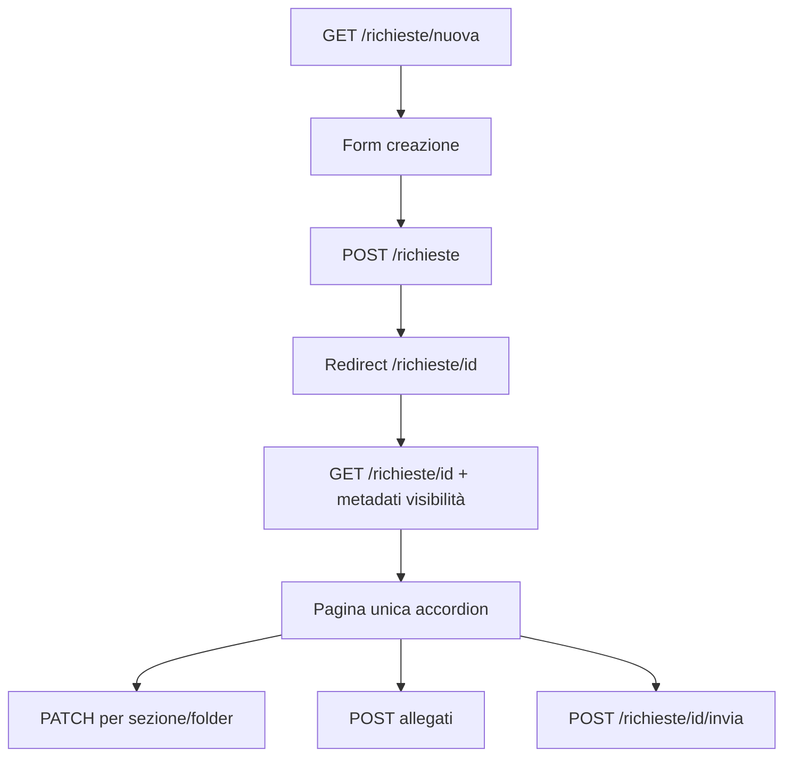

# Creazione richiesta — analisi entità e proposta UI/API

Documento di analisi per la migrazione del flusso legacy **Nuova richiesta** e **wizard di compilazione** verso `sprintbff` + `sprintwcl`.

**Decisione UX (target):** tutte le sezioni oggi distribuite su più pagine Struts convergono in **un'unica pagina Angular** con **collapse annidati**: i 6 *folder* legacy diventano pannelli di primo livello; le sotto-sezioni (`<h4>` nei JSP) diventano collapse interni.

**Fonti legacy (sola lettura):**

| Artefatto | Percorso |
|-----------|----------|
| Action creazione | `sprintj/.../NuovaRichiestaAction.java` |
| Action wizard | `sprintj/.../RichiestaAction.java` (`chooseNextFolder`, `saveDati*`, `dettaglioRichiesta`) |
| JSP creazione iniziale | `sprintj/.../jsp/richiesta/richiestaNuova.jsp` |
| JSP sezioni wizard | `sprintj/.../jsp/richiesta/datiMappa.jsp`, `datiGenerali.jsp`, `datiTecnicoAmministrativi.jsp`, `datiEconomici.jsp`, `valutazionePericolosita.jsp`, `analisiDelRischio.jsp`, `allegatiRichiesta.jsp` |
| Business | `sprintj/.../business/session/richiesta/RichiestaBean.java` |
| DAO | `sprintj/.../integration/dao/richiesta/` |
| Metadati visibilità | `RichiestaDAOImpl.findHiddenFolderByLegge`, `findHiddenSectionByLegge`, `findHiddenFieldByLegge` |
| Config Struts | `sprintj/.../WEB-INF/struts-config-richiesta.xml` |
| Validazione | `sprintj/.../WEB-INF/validation-richiesta.xml` |

---

## 1. Cosa fa il flusso legacy

### 1.1 Creazione bozza (`nuovaRichiesta.do`)

1. `GET /nuovaRichiesta.do` → `richiestaNuova.jsp` con form minimale.
2. L'utente compila: oggetto finanziamento, legge, evento (condizionale), note, provincia/comune, coordinate opzionali, soggetto segnalatore (read-only da profilo).
3. `POST /saveNuovaRichesta.do` → crea richiesta in DB (stato bozza o *in verifica centrale* per ruoli centrali), associa evento se necessario, imposta geometria punto sul centroide comune.
4. Redirect a `bridgeDettaglioNuovaRichiesta.do` → `dettaglioRichiesta.do` → `datiMappa.do` (primo folder del wizard).

**Campi obbligatori in creazione** (`validation-richiesta.xml`):

| Campo | Note |
|-------|------|
| `descrizioneDanno` | Oggetto dell'eventuale finanziamento |
| `idLeggeRichiesta` | Legge applicabile |
| `idSuggestComune` | Comune (autocomplete LOTO) |

**Regole evento per legge** (`richiestaNuova.jsp`):

| `idLegge` | Comportamento |
|-----------|---------------|
| `5` (straordinaria) | Select evento straordinario obbligatorio |
| `2` (legge 38) | Select evento + pulsante «nuovo evento» |
| altre | Nessun evento in creazione |

### 1.2 Wizard post-creazione (6 pagine + allegati)

Dopo la creazione, il legacy guida l'utente attraverso **6 folder** numerati 0–5, con navigazione lineare «conferma e prosegui» / `chooseNextFolder.do` che salta i folder nascosti per legge.

| ID folder | Pagina legacy | Action save |
|-----------|---------------|-------------|
| `0` | Dati mappa | `saveDatiMappa` |
| `1` | Dati generali | `saveDatiGenerali` |
| `2` | Dati tecnico-amministrativi | `saveDatiTecnicoAmministrativi` |
| `3` | Dati economici | `saveDatiEconomici` |
| `4` | Valutazione pericolosità | `saveValutazionePericolosita` |
| `5` | Analisi del rischio | `saveAnalisiDelRischio` |

Gli **allegati** sono su pagina separata (`allegatiRichiesta.jsp`), raggiungibile dopo il completamento del wizard.

La visibilità di folder, sezioni e singoli campi è **configurabile per legge** tramite tabelle metadati (`SPRINT_MTD_*`); il BFF deve esporre la stessa logica.

---

## 2. Proposta UX: pagina unica con collapse

### 2.1 Route Angular

| Route | Scopo |
|-------|-------|
| `/richieste/nuova` | Form iniziale ridotto (equivalente `richiestaNuova.jsp`) |
| `/richieste/:id` | Pagina unica di compilazione / visualizzazione con tutti i collapse |

Dopo `POST /richieste` (creazione), redirect a `/richieste/{id}` con tutti i pannelli disponibili.

### 2.2 Struttura collapse (folder → sotto-sezioni)

Ogni **folder legacy** diventa un **collapse di primo livello** (`mat-expansion-panel` o equivalente). Le `<h4>` dei JSP diventano **collapse annidati** (secondo livello).

```
Pagina /richieste/:id
│
├─ [Collapse L1] Dati mappa                    (folder 0, idSezione 0)
│
├─ [Collapse L1] Dati generali                 (folder 1)
│   ├─ [Collapse L2] Dati generali             (idSezione 1)
│   ├─ [Collapse L2] Dati protocollo           (idSezione 2)
│   ├─ [Collapse L2] Localizzazione danno      (idSezione 3)
│   ├─ [Collapse L2] Dissesto                  (idSezione 4 — parte 1)
│   └─ [Collapse L2] Categoria e sottocategoria di danno (idSezione 4 — parte 2)
│
├─ [Collapse L1] Dati tecnico-amministrativi   (folder 2)
│   ├─ [Collapse L2] Effetti del danno         (idSezione 5)
│   ├─ [Collapse L2] Descrizione intervento    (idSezione 6)
│   ├─ [Collapse L2] Opera prevalente          (sotto blocco intervento)
│   ├─ [Collapse L2] Valutazione economica intervento (idSezione 7)
│   ├─ [Collapse L2] Soggetto richiedente      (idSezione 8)
│   ├─ [Collapse L2] Anagrafica referente
│   ├─ [Collapse L2] Amministrazione esecutrice
│   ├─ [Collapse L2] Compilatore               (idSezione 9)
│   ├─ [Collapse L2] Informazioni fasi tecnico-amministrative (idSezione 10)
│   └─ [Collapse L2] Stato della progettazione
│
├─ [Collapse L1] Dati economici                (folder 3)
│   ├─ [Collapse L2] Quadro economico          (idSezione 11)
│   ├─ [Collapse L2] Piano finanziario         (idSezione 12)
│   ├─ [Collapse L2] Richiesta finanziamento annualità (idSezione 23)
│   ├─ [Collapse L2] Progetto generale         (idSezione 13)
│   ├─ [Collapse L2] Stralci eseguiti o finanziati (idSezione 14)
│   └─ [Collapse L2] W.F.R. Dati economici     (idSezione 24)
│
├─ [Collapse L1] Valutazione pericolosità      (folder 4)
│   ├─ [Collapse L2] Dissesto idrogeologico: frane   (idSezione 15)
│   ├─ [Collapse L2] Dissesto idrogeologico: conoidi (idSezione 16)
│   ├─ [Collapse L2] Dissesto idrogeologico: valanghe (idSezione 17)
│   ├─ [Collapse L2] Dissesto rete idrografica superficiale (idSezione 18)
│   └─ [Collapse L2] Valutazione evento piena/pioggia critico
│
├─ [Collapse L1] Analisi del rischio           (folder 5)
│   ├─ [Collapse L2] Elementi a rischio        (idSezione 19)
│   ├─ [Collapse L2] Classe di vulnerabilità   (idSezione 20)
│   ├─ [Collapse L2] Valutazione del danno     (idSezione 21)
│   └─ [Collapse L2] Valutazioni del rischio   (idSezione 22)
│
└─ [Collapse L1] Allegati                      (pagina separata legacy)
```

### 2.3 Comportamento rispetto al wizard legacy

| Aspetto legacy | Comportamento nuovo |
|----------------|---------------------|
| Navigazione lineare folder 0→5 | **Eliminata**: l'utente apre qualsiasi collapse visibile |
| Barra «Sezioni» con pulsanti disabilitati in wizard | **Eliminata**: sostituita dall'accordion |
| `chooseNextFolder` / `choosePrevFolder` | Non necessari lato frontend |
| `wizard=true` blocca navigazione tra folder | Non applicabile: tutto su una pagina |
| Salvataggio per pagina (`saveDati*`) | `PATCH` per folder o per sezione (vedi §4) |
| Allegati separati | Collapse L1 in fondo alla stessa pagina (o tab secondario se troppo pesante) |

### 2.4 Stato UI consigliato

- **Apertura iniziale:** dopo creazione, espandere automaticamente il primo folder visibile (oggi `datiMappa`, id `0`).
- **Indicatori di completezza:** icona/badge su ogni collapse L1 (es. validato / incompleto / nascosto) derivata dalle stesse regole di `validation-richiesta.xml` e dallo stato richiesta.
- **Read-only:** se `azione = VIEW` o stato non modificabile, tutti i collapse in sola lettura (equivalente `isReadOnly=true` legacy).
- **Visibilità dinamica:** folder/sezioni/campi nascosti per legge non vengono renderizzati (non solo `display:none`).

---

## 3. Diagramma flusso

### 3.1 Legacy



### 3.2 Target Angular



---

## 4. Entità coinvolte

### 4.1 Legenda colonne

| Colonna | Significato |
|---------|-------------|
| **Uso UI** | Collapse / campo nella nuova pagina |
| **Origine dati** | DAO / servizio legacy |
| **Tabelle DB** | Oggetti Oracle |
| **API proposta** | Endpoint REST riusabile |

### 4.2 Metadati visibilità (per legge)

| Entità | Uso UI | Origine dati | Tabelle DB | API proposta |
|--------|--------|--------------|------------|--------------|
| **Folder** | Collapse L1 mostrato/nascosto | `findHiddenFolderByLegge` | `SPRINT_MTD_FOLDER`, `SPRINT_MTD_R1_FOLDERLEGGE` | `GET /richieste/{id}/layout` |
| **Sezione** | Collapse L2 mostrato/nascosto | `findHiddenSectionByLegge` | `SPRINT_MTD_SEZIONE`, `SPRINT_MTD_R2_SEZIONELEGGE` | *(incluso in layout)* |
| **Campo** | Singolo controllo mostrato/nascosto | `findHiddenFieldByLegge` | `SPRINT_MTD_CAMPO`, `SPRINT_MTD_R3_CAMPO_SEZLEGGE` | *(incluso in layout)* |

**Nota:** `hiddenFolders` nel legacy contiene gli ID **nascosti** (blacklist). La API deve esporre la lista di folder/sezioni **visibili** o la blacklist con semantica documentata.

### 4.3 Creazione iniziale (`/richieste/nuova`)

| Campo UI | Tipo | Origine lookup | Tabelle DB | API |
|----------|------|----------------|------------|-----|
| Oggetto finanziamento | textarea | form | `SPRINT_T_RIC_GENERICA.DESCRIZIONE_DANNO` | body `POST /richieste` |
| Legge | select | `SprintMtdLeggeDAO.findAll` | `SPRINT_MTD_LEGGE` | `GET /leggi` *(già in ricerca)* |
| Evento straordinario | select | `RicercaDAO.findAllEventiStraordinari` | `SPRINT_T_EVENTO` | `GET /eventi?straordinario=true` |
| Evento legge 38 | select | eventi per comune/provincia | `SPRINT_T_EVENTO`, `SPRINT_R_EVENTO_COMUNE` | `GET /eventi` |
| Descrizione nuovo evento | textarea | — | `SPRINT_T_EVENTO` | body `POST /richieste` o `POST /eventi` |
| Note | textarea | — | `SPRINT_T_RIC_GENERICA.NOTE` | body |
| Provincia | select | hardcoded Piemonte | — | `GET /province` |
| Comune | autocomplete | LOTO `cercaComuni` | — | `GET /comuni/suggest` |
| Coordinate X/Y | number | — | `SPRINT_R_GEOMETRIA_RICHIESTA` | body |
| Ente / utente segnalatore | read-only | `FrontEndContext` | `SPRINT_T_APPG_AGGREGAZIONI` | `GET /utente/contesto` o incluso in init |

### 4.4 Folder 0 — Dati mappa

| Campo UI | Origine | Tabelle DB | API |
|----------|---------|------------|-----|
| Mappa interattiva (punto/linea/poligono) | SDO / cartografico | `SPRINT_R_GEOMETRIA_RICHIESTA` | `GET/PUT /richieste/{id}/geometria` |
| Layer comune / estensione | LOTO | — | servizio territorio |
| Flag georiferito | form | `SPRINT_T_RIC_GENERICA` | body patch |

### 4.5 Folder 1 — Dati generali (collapse L2)

| Sotto-sezione | Campi principali | Tabelle DB | Lookup API |
|---------------|------------------|------------|------------|
| **Dati generali** | codice richiesta, data inserimento, evento associato, stato, data modifica, utente modifica, determina modifica | `SPRINT_T_RIC_GENERICA`, `SPRINT_T_RIC_38_CALAMITA` | `GET /richieste/stati`, `GET /eventi` |
| **Dati protocollo** | protocollo ricevimento/uscita/entrata, date, codice WIRP, pratica W.F.R. | `SPRINT_T_RIC_GENERICA` | — |
| **Localizzazione danno** | località, indirizzo (TOPE), altro indirizzo, civico, tipo strada, denominazione strada, corso d'acqua, sedime, fascia PAI, dissesto PAI | `SPRINT_T_RIC_GENERICA`, `SPRINT_R_RIC_GENERICA_COMUNE`, lookup `SPRINT_D_*` | `GET /indirizzi/suggest`, `GET /tipi-strada`, `GET /sedimi` |
| **Dissesto** | descrizione dissesto, flag vari | `SPRINT_T_RIC_GENERICA`, `SPRINT_T_RIC_38_CALAMITA` | lookup legge-specifici |
| **Categoria danno** | macrocategoria, categoria, sottocategoria, codice danno | `SPRINT_D_RICHIESTA_GENERICA`, `SPRINT_MTD_RIC_GENERICA` | `GET /richieste/categorie`, `GET /richieste/metadati/{legge}` |

### 4.6 Folder 2 — Dati tecnico-amministrativi

| Sotto-sezione | Campi principali | Tabelle DB |
|---------------|------------------|------------|
| Effetti del danno | tipologie effetto, descrizioni | `SPRINT_T_RIC_GENERICA`, `SPRINT_R_RIC_GENERICA_DINAMICA` |
| Descrizione intervento | tipo/motivo intervento, descrizione, date | `SPRINT_T_RIC_GENERICA`, lookup |
| Opera prevalente | opere collegate | `SPRINT_R_RIC_GENERICA_DINAMICA` |
| Valutazione economica intervento | importi stimati, IVA | `SPRINT_T_RIC_GENERICA` |
| Soggetto richiedente | ente, CF/P.IVA, recapiti | `SPRINT_T_RIC_GENERICA`, TOPE |
| Anagrafica referente | nominativo, contatti | `SPRINT_T_RIC_GENERICA` |
| Amministrazione esecutrice | ente esecutore | `SPRINT_T_RIC_GENERICA` |
| Compilatore | utente inserimento | `SPRINT_T_RIC_GENERICA` |
| Fasi tecnico-amministrative | date sopralluogo, perizia, ecc. | `SPRINT_T_RIC_GENERICA` |
| Stato progettazione | flag e date progettazione | `SPRINT_T_RIC_GENERICA` |

### 4.7 Folder 3 — Dati economici

| Sotto-sezione | Tabelle principali |
|---------------|-------------------|
| Quadro economico | `SPRINT_T_RIC_GENERICA`, importi per voce |
| Piano finanziario | tabelle legge-specifiche |
| Richiesta finanziamento annualità | annualità per esercizio |
| Progetto generale | dati progetto |
| Stralci eseguiti/finanziati | `SPRINT_S_STRALCIO`, relazioni |
| W.F.R. Dati economici | campi integrazione WFR |

### 4.8 Folder 4 — Valutazione pericolosità

| Sotto-sezione | Tabelle principali |
|---------------|-------------------|
| Frane / Conoidi / Valanghe | `SPRINT_T_RIC_38_CALAMITA`, lookup `SPRINT_D_*` |
| Rete idrografica | campi idrogeologici |
| Evento piena/pioggia | valutazioni rischio idraulico |

### 4.9 Folder 5 — Analisi del rischio

| Sotto-sezione | Tabelle principali |
|---------------|-------------------|
| Elementi a rischio | `SPRINT_MTD_ANALISI_RISCHIO`, `SPRINT_R_RIC_GENERICA_DINAMICA` |
| Classe vulnerabilità | lookup analisi rischio |
| Valutazione danno | `SPRINT_D_ANALISI_RISCHIO` |
| Valutazioni rischio | `SPRINT_T_ANALISI_RISCHIO` (se presente) |

### 4.10 Allegati

| Campo UI | Tabelle DB | API |
|----------|------------|-----|
| Elenco allegati | `SPRINT_T_ALLEGATO_RIC`, `SPRINT_R_RICGEN_ALLEGATO` | `GET /richieste/{id}/allegati` |
| Upload file | blob storage + metadati | `POST /richieste/{id}/allegati` |
| Elimina / download | — | `DELETE`, `GET .../allegati/{id}` |

---

## 5. Proposta API Swagger (bozza)

Contratto target: `sprintbff/src/main/resources/static/api/openapi.yaml`

### 5.0 Principio di naming

Come per la ricerca, le API sono per **risorsa di dominio**, non per pagina.

| Livello | Esempio | Quando |
|---------|---------|--------|
| Dominio | `GET /leggi`, `GET /richieste/stati` | Lookup riusabili |
| Risorsa richiesta | `GET/POST/PATCH /richieste`, `/richieste/{id}` | CRUD richiesta |
| Sotto-risorsa | `/richieste/{id}/geometria`, `/allegati`, `/layout` | Sezioni della pagina unica |
| Composizione pagina | `GET /pagine/richiesta/{id}/init` | Aggregato BFF opzionale |

**Tag OpenAPI suggeriti:** `Richieste`, `Eventi`, `Territorio`, `Leggi`, `Allegati`, `Pagine`

### 5.1 Endpoint principali

```yaml
paths:
  /richieste:
  post:
    summary: Crea nuova richiesta (bozza)
    tags: [Richieste]
    requestBody:
      $ref: '#/components/schemas/CreaRichiestaRequest'
    responses:
      '201':
        description: Richiesta creata
        content:
          application/json:
            schema:
              $ref: '#/components/schemas/RichiestaDetailResponse'

  /richieste/{idRichiesta}:
  get:
    summary: Dettaglio richiesta completo (tutti i folder)
    tags: [Richieste]
  patch:
    summary: Aggiorna parzialmente la richiesta
  description: |
    Il body può limitarsi al folder/sezione modificata.
    Alternativa: path dedicati per folder (vedi sotto).

  /richieste/{idRichiesta}/layout:
  get:
    summary: Metadati visibilità folder/sezioni/campi per la legge della richiesta
    tags: [Richieste]
    responses:
      '200':
        content:
          application/json:
            schema:
              $ref: '#/components/schemas/RichiestaLayoutResponse'

  /richieste/{idRichiesta}/geometria:
  get:
    summary: Geometria richiesta (punto/linea/poligono)
  put:
    summary: Salva geometria

  /richieste/{idRichiesta}/folders/{idFolder}:
  patch:
    summary: Salva un singolo folder (equivalente saveDati*)
    description: idFolder 0-5 come in Constants legacy

  /richieste/{idRichiesta}/allegati:
  get:
    summary: Elenco allegati
  post:
    summary: Carica allegato (multipart)

  /richieste/{idRichiesta}/invia:
  post:
    summary: Conferma invio richiesta (equivalente confermaInviaRichiesta)

  /pagine/richiesta/{idRichiesta}/init:
  get:
    summary: Aggregato per prima paint della pagina unica
    description: |
      Opzionale. Restituisce in un'unica risposta:
      dettaglio richiesta, layout visibilità, lookup comuni alla legge,
      stati ammessi, eventi associabili.
    tags: [Pagine]
```

### 5.2 Schemi principali

```yaml
components:
  schemas:
    CreaRichiestaRequest:
      type: object
      required: [descrizioneDanno, idLegge, idComune]
      properties:
        descrizioneDanno:
          type: string
          maxLength: 1000
        idLegge:
          type: integer
        idComune:
          type: integer
        idEvento:
          type: integer
          nullable: true
        descrizioneNuovoEvento:
          type: string
          nullable: true
        note:
          type: string
          maxLength: 1000
        coordX:
          type: number
          nullable: true
        coordY:
          type: number
          nullable: true

    RichiestaLayoutResponse:
      type: object
      properties:
        idLegge:
          type: integer
        folders:
          type: array
          items:
            $ref: '#/components/schemas/FolderLayoutItem'
        hiddenFieldIds:
          type: array
          items:
            type: integer

    FolderLayoutItem:
      type: object
      properties:
        idFolder:
          type: integer
          description: "0=dati mappa, 1=dati generali, ..."
        nome:
          type: string
        visible:
          type: boolean
        sections:
          type: array
          items:
            $ref: '#/components/schemas/SezioneLayoutItem'

    SezioneLayoutItem:
      type: object
      properties:
        idSezione:
          type: integer
        nome:
          type: string
        visible:
          type: boolean

    RichiestaDetailResponse:
      type: object
      description: DTO aggregato; struttura interna da modellare per folder
      properties:
        idRichiesta:
          type: integer
        codRichiesta:
          type: string
        idLegge:
          type: integer
        stato:
          $ref: '#/components/schemas/LookupItem'
        datiMappa:
          type: object
        datiGenerali:
          type: object
        datiTecnicoAmministrativi:
          type: object
        datiEconomici:
          type: object
        valutazionePericolosita:
          type: object
        analisiDelRischio:
          type: object
```

### 5.3 Riutilizzo API già previste (ricerca)

| API esistente / prevista | Uso in creazione richiesta |
|--------------------------|----------------------------|
| `GET /leggi` | Select legge |
| `GET /province`, `GET /comuni/suggest` | Localizzazione |
| `GET /eventi` | Associazione evento |
| `GET /richieste/stati` | Cambio stato (ruoli abilitati) |
| `GET /tipi-ente` | Soggetto richiedente |

---

## 6. Implementazione frontend (`sprintwcl`)

### 6.1 Componenti suggeriti

```
pages/richiesta/
  nuova-richiesta.component.ts       # form creazione (/richieste/nuova)
  richiesta-detail.component.ts      # pagina unica accordion (/richieste/:id)
  sections/
    folder-dati-mappa.component.ts
    folder-dati-generali.component.ts
    folder-dati-tecnico-ammin.component.ts
    folder-dati-economici.component.ts
    folder-valutazione-pericolosita.component.ts
    folder-analisi-rischio.component.ts
    folder-allegati.component.ts
  collapse/
    richiesta-collapse-panel.component.ts   # wrapper L1/L2 con visibilità da layout
```

### 6.2 Regole componente collapse

1. Riceve `layout: RichiestaLayoutResponse` e renderizza solo nodi con `visible: true`.
2. Collapse L2 annidati dentro L1; **un solo L1 espanso alla volta** (opzionale, da validare con UX).
3. Salvataggio: pulsante «Salva» per folder (footer del pannello L1) → `PATCH /richieste/{id}/folders/{idFolder}`.
4. Validazione inline con stessi vincoli di `validation-richiesta.xml`; campi `*` = obbligatori per salvataggio, `**` = obbligatori per invio.
5. In modalità VIEW, `mat-expansion-panel` disabilitato ma espandibile per consultazione.

### 6.3 Mapping costanti legacy → UI

| Costante Java | idFolder / idSezione | Collapse UI |
|---------------|---------------------|-------------|
| `ID_FOLDER_DATI_MAPPA` | 0 | L1 Dati mappa |
| `ID_FOLDER_DATI_GENERALI` | 1 | L1 Dati generali |
| `ID_SEZIONE_DATI_GENERALI` | 1 | L2 Dati generali |
| `ID_SEZIONE_DATI_PROTOCOLLO` | 2 | L2 Dati protocollo |
| `ID_SEZIONE_LOCALIZZAZIONE_DANNO` | 3 | L2 Localizzazione danno |
| `ID_FOLDER_DATI_TECNICO_AMMINISTRATIVI` | 2 | L1 Dati tecnico-amministrativi |
| `ID_FOLDER_DATI_ECONOMICI` | 3 | L1 Dati economici |
| `ID_FOLDER_VALUTAZIONE_PERICOLOSITA` | 4 | L1 Valutazione pericolosità |
| `ID_FOLDER_ANALISI_DEL_RISCHIO` | 5 | L1 Analisi del rischio |

*(mapping completo in `Constants.java`, righe 70–108)*

---

## 7. Note tecniche per l'implementazione BFF

1. **Profilo utente:** stato iniziale bozza vs *in verifica centrale* dipende da `ruolo@dominio` (`NuovaRichiestaAction`). Replicare in `RichiesteManager`.

2. **LOTO / comuni:** la creazione usa `CommonBusinessDelegate.cercaComuneById` e centroide per geometria default. Valutare integrazione LOTO nel BFF come per la ricerca.

3. **Legge-specific tables:** oltre a `SPRINT_T_RIC_GENERICA`, persistono tabelle per legge (`SPRINT_T_RIC_38_CALAMITA`, `SPRINT_T_RIC_183`, …). Il Manager deve instradare per `idLegge`.

4. **Metadati MTD:** non duplicare la logica hidden in frontend; esporre `GET /richieste/{id}/layout` calcolato lato server con le stesse query di `loadHiddenInfoByLegge`.

5. **Salvataggio:** il legacy salva per pagina e tiene tutto in sessione Struts. Nel nuovo stack preferire **salvataggio esplicito per folder** con `PATCH` (evita payload enormi e conflitti), oppure autosave debounced per sezione.

6. **Mappa:** il folder 0 integra componente cartografico (probabilmente iframe/SDK esistente). Tenere come collapse L1 dedicato con altezza fissa.

7. **Storico:** `storicoRichiesta.jsp` resta fuori scope; stessa pagina in sola lettura con snapshot storico è evoluzione futura.

8. **Validazione invio:** `confermaInviaRichiesta` applica controlli più stringenti (campi `**`). Esporre `POST /richieste/{id}/invia` con errori strutturati per collapse (es. `{ folderId, sectionId, field, message }`) per scroll automatico al pannello errato.

---

## 8. Fasi di implementazione suggerite

| Fase | Scope | Deliverable |
|------|-------|-------------|
| **1** | Creazione bozza + layout metadati | `POST /richieste`, `GET /richieste/{id}/layout`, pagina `/richieste/nuova`, shell accordion vuota |
| **2** | Folder 0–1 | Geometria + dati generali completi, collapse L1/L2 |
| **3** | Folder 2–3 | Tecnico-amministrativi + economici |
| **4** | Folder 4–5 | Pericolosità + analisi rischio |
| **5** | Allegati + invio | Upload, `POST /richieste/{id}/invia` |
| **6** | Modifica / riapertura | Equivalente `riapriRichiesta*`, VIEW mode |

---

## 9. Prossimi passi

- [ ] Validare con UX se allegati restano collapse L1 o tab separato
- [ ] Definire DTO dettaglio per ogni folder (sub-schemas OpenAPI)
- [ ] Trasferire schemi in `openapi.yaml`
- [ ] Aggiornare `schema/api-tables.md` per ogni endpoint
- [ ] Implementare `RichiesteManager` + `RichiestaLayoutManager` in `sprintbff`
- [ ] Scaffold componenti accordion in `sprintwcl`
- [ ] Estrarre elenco campi per sotto-sezione dai JSP (task di affinamento incrementale per folder)
