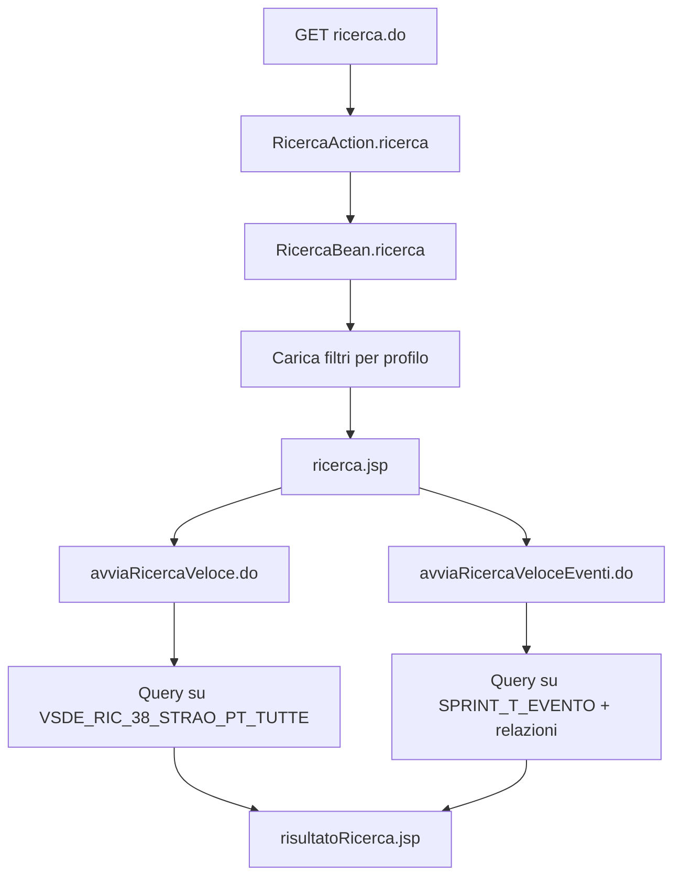

# Ricerca (`ricerca.do`) — analisi entità e proposta API

Documento di analisi per la migrazione della pagina legacy **Ricerca** verso `sprintbff` + `sprintwcl`.

**Fonti legacy (sola lettura):**

| Artefatto | Percorso |
|-----------|----------|
| Action Struts | `sprintj/.../RicercaAction.java` → metodo `ricerca()` |
| JSP | `sprintj/.../jsp/ricerca/ricerca.jsp` |
| Business | `sprintj/.../business/session/ricerca/RicercaBean.java` |
| DAO ricerca | `sprintj/.../integration/dao/ricerca/` |
| Config Struts | `sprintj/.../WEB-INF/struts-config-ricerca.xml` |

---

## 1. Cosa fa `ricerca.do`

`GET /ricerca.do` (parametro Struts `ricerca`) è il punto di ingresso del **motore di ricerca**:

1. Pulisce la sessione di ricerca precedente.
2. Carica i **filtri** (dropdown e liste) in base al profilo utente (`ruolo@dominio`).
3. Renderizza `ricerca.jsp`.

Dalla pagina l'utente può avviare due ricerche attive:

| Sezione UI | Submit legacy | Tipo risultato |
|------------|---------------|----------------|
| Ricerca richiesta | `avviaRicercaVeloce.do` | Richieste (`tipoOggetto = R`) |
| Ricerca eventi | `avviaRicercaVeloceEventi.do` | Eventi (`tipoOggetto = E`) |

Sezioni **commentate** nel JSP (caricate in sessione ma non mostrate): ricerca predefinita, ricerca avanzata.

---

## 2. Diagramma flusso (pagina + submit)



---

## 3. Entità coinvolte

### 3.1 Legenda colonne

| Colonna | Significato |
|---------|-------------|
| **Uso pagina** | Come compare in `ricerca.jsp` |
| **Origine dati** | DAO / servizio legacy |
| **Tabelle DB** | Oggetti Oracle toccati |
| **API proposta** | Endpoint REST riusabile (senza prefisso `/ricerca`) |

---

### 3.2 Filtri — ricerca veloce richieste

| Entità | Uso pagina | Origine dati | Tabelle DB | API proposta |
|--------|------------|--------------|------------|--------------|
| **Provincia** | Select `idProvinciaRicerca` | `RicercaTopeDAO.findAllProvincie()` — lista hardcoded Piemonte | — (nessuna tabella) | `GET /province` |
| **Comune** | Autocomplete `idSuggestComune` | `RicercaVeloceComune` servlet; in ricerca usa `all=true` → servizio LOTO `cercaComuni` | `VSDE_RIC_38_STRAO_PT_TUTTE` (modalità senza `all`) | `GET /comuni/suggest` |
| **Stato richiesta** | Select `idStatoRicerca` | `RicercaDAO.findAllStati()` | `SPRINT_D_RICHIESTA_GENERICA` (`NOME_COLONNA = 'FK_STATO'`) | `GET /richieste/stati` |
| **Legge** | Select `idLeggeRicerca` | `SprintMtdLeggeDAO.findAll()` | `SPRINT_MTD_LEGGE` | `GET /leggi` |
| **Evento associato** | Select `idEventoRicerca` | `RicercaDAO.findAllEventiStraordinari()` — filtrato per provincia se utente territoriale | `SPRINT_T_EVENTO`, `SPRINT_R_EVENTO_COMUNE` | `GET /eventi` (filtro `straordinario`) |
| **Codice richiesta** | Input testo `codiceRichiesta` | Filtro su vista al submit | `VSDE_RIC_38_STRAO_PT_TUTTE` | *(campo body in `POST /richieste/cerca`)* |
| **Data inserimento** | Date `dataEmissioneDal/Al` | Filtro al submit | `VSDE_RIC_38_STRAO_PT_TUTTE` | *(campo body)* |
| **Data modifica** | Date `dataModificaDal/Al` | Filtro al submit | `VSDE_RIC_38_STRAO_PT_TUTTE` | *(campo body)* |
| **Cognome compilatore** | Autocomplete `idSuggestCognome` | `RicercaVeloceCognome` → `RichiestaDAO.findAllCognomiCompilatore` | `VSDE_RIC_38_STRAO_PT_TUTTE` | `GET /richieste/compilatori/suggest` |
| **Dissesto senso PAI** | Select `flgDissenstoSensoPai` | Valori Si/No hardcoded in `RicercaAction` | — | enum frontend |
| **Provvedimento finanziamento** | Input testo | Filtro al submit | `VSDE_RIC_38_STRAO_PT_TUTTE` | *(campo body)* |
| **Ente richiedente** | Select `enteRichiedente` | `RichiestaDAO.findLkTipoAggregazione()` | `SPRINT_T_APPG_AGGREGAZIONI` | `GET /tipi-ente` |
| **Richiesta georiferita** | Select `flgRichiestaGeoriferita` | Valori Si/No hardcoded in `RicercaAction` | — | enum frontend |

---

### 3.3 Filtri — ricerca veloce eventi

| Entità | Uso pagina | Origine dati | Tabelle DB | API proposta |
|--------|------------|--------------|------------|--------------|
| **Evento** (risultato ricerca) | Input `descrizioneEvento` + risultati | `RicercaDAO` query eventi per descrizione | `SPRINT_T_EVENTO`, `SPRINT_D_EVENTO`, `SPRINT_R_EVENTO_COMUNE`, `SPRINT_T_AREA_IDRO`, `SPRINT_R_AREA_IDRO_EVENTO` | `POST /eventi/cerca` |

---

### 3.4 Metadati motore ricerca (caricati al load, UI avanzata disabilitata)

| Entità | Uso | Origine dati | Tabelle DB | API proposta |
|--------|-----|--------------|------------|--------------|
| **Ricerca predefinita** | Dropdown commentato `idRicercaPredefinita` | `RicercaDAO.findMtdRicercaPredByProfilo()` | `SPRINT_MTD_RICERCA_PRED_CLOB`, `SPRINT_MTD_PROFILO_UTENTE`, `SPRINT_MTD_R_PROFILO_RICERCA` | `GET /motore-ricerca/predefinite` |
| **Oggetto ricerca** | Lista oggetti ricerca avanzata | `RicercaDAO.findMtdOggettoByProfilo()` | `SPRINT_MTD_OGGETTO`, `SPRINT_MTD_R_OGG_PROF`, `SPRINT_MTD_PROFILO_UTENTE` | `GET /motore-ricerca/oggetti` |
| **Criterio ricerca** | Per oggetto selezionato | `RicercaDAO.findMtdCriterioByProfiloAndOggetto()` | `SPRINT_MTD_CRITERIO`, `SPRINT_MTD_R_CRITERIO_OGGPROF` | `GET /motore-ricerca/oggetti/{idOggetto}/criteri` |
| **Campo risultato ricerca** | Colonne tabella risultati | `RicercaDAO.findMtdCampoRisRicercaByProfiloAndOggetto()` | `SPRINT_MTD_CAMPO_RIS_RICERCA`, `SPRINT_MTD_R_CAMPO_OGGPROF` | `GET /motore-ricerca/oggetti/{idOggetto}/campi-risultato` |
| **Valori criterio** | Elenco valori per criterio | Dipende dal tipo criterio (lookup, date, …) | Varie (`SPRINT_D_*`, viste) | `GET /motore-ricerca/criteri/{idCriterio}/valori` |

---

### 3.5 Entità risultato (dopo submit)

| Entità | Descrizione | Tabelle principali | API proposta |
|--------|-------------|-------------------|--------------|
| **Richiesta** (item risultato) | `ItemMotoreRicercaDTO`: id, codice, descrizione, stato, comune, geometria | `VSDE_RIC_38_STRAO_PT_TUTTE` → `SPRINT_T_RIC_GENERICA`, `SPRINT_T_RIC_38_CALAMITA`, `SPRINT_R_RIC_GENERICA_COMUNE`, … | `POST /richieste/cerca` |
| **Evento** (item risultato) | id, codEvento, descrizione, comuni, aree idro, date | `SPRINT_T_EVENTO` + relazioni | `POST /eventi/cerca` |

---

## 4. Proposta API Swagger (bozza)

Contratto target: `sprintbff/src/main/resources/static/api/openapi.yaml`

### 4.0 Principio di naming

Le API sono organizzate per **risorsa di dominio**, non per pagina. Così gli stessi endpoint servono ricerca, nuova richiesta, eventi, mappa, ecc.

| Livello | Prefisso path | Esempio | Quando usarlo |
|---------|---------------|---------|---------------|
| **Dominio** | nessuno (risorsa radice) | `/leggi`, `/province`, `/richieste/stati` | Lookup e CRUD riusabili ovunque |
| **Azione su risorsa** | sotto-risorsa della entità | `POST /richieste/cerca`, `POST /eventi/cerca` | Ricerca / operazioni specifiche del dominio |
| **Motore ricerca** | `/motore-ricerca` | `/motore-ricerca/oggetti` | Solo metadati del query builder (oggetti, criteri, predefinite) |
| **Composizione pagina** *(opzionale)* | `/pagine/{nome}` | `GET /pagine/ricerca/init` | Aggregato BFF per una singola schermata; non sostituisce le API di dominio |

**Tag OpenAPI suggeriti:** `Territorio`, `Leggi`, `Enti`, `Richieste`, `Eventi`, `MotoreRicerca`

**Riutilizzo atteso:**

| API | Altre sezioni che la useranno |
|-----|------------------------------|
| `GET /leggi` | Nuova richiesta, dettaglio, filtri report |
| `GET /province`, `GET /comuni/suggest` | Mappa, inserimento richiesta, eventi |
| `GET /richieste/stati` | Workflow richiesta, liste, dashboard |
| `GET /tipi-ente` | Form richiesta, associazioni |
| `GET /eventi` | Associazione evento–richiesta, filtri |
| `POST /richieste/cerca` | Ricerca, export, selezione multipla |

---

```yaml
components:
  schemas:
    LookupItem:
      type: object
      properties:
        codice:
          type: string
          description: Valore da inviare nei filtri (id, codice ISTAT, ecc.)
        descrizione:
          type: string
      required: [codice, descrizione]

    LeggeItem:
      type: object
      properties:
        idLegge:
          type: integer
        nomeLegge:
          type: string
        codice:
          type: string
          nullable: true

    TipoEnteItem:
      type: object
      properties:
        idTipoaggr:
          type: integer
        tipoAggr:
          type: string

    OggettoRicercaItem:
      type: object
      properties:
        idOggetto:
          type: integer
        alias:
          type: string
        tipoOggetto:
          type: string
          description: "R = richiesta, E = evento"
        legge:
          type: integer
          nullable: true
        stato:
          type: integer
          nullable: true

    RicercaPredefinitaItem:
      type: object
      properties:
        idRicercaPred:
          type: integer
        titoloRicerca:
          type: string
        tipoOggetto:
          type: string

    CercaRichiesteRequest:
      type: object
      properties:
        provincia:
          type: string
          description: Codice ISTAT provincia
        comune:
          type: string
          description: Id toponimo comune (da suggest)
        codiceRichiesta:
          type: string
        stato:
          type: string
        legge:
          type: integer
        evento:
          type: integer
        dataInserimentoDal:
          type: string
          format: date
        dataInserimentoAl:
          type: string
          format: date
        dataModificaDal:
          type: string
          format: date
        dataModificaAl:
          type: string
          format: date
        cognomeCompilatore:
          type: string
        flgDissestoSensoPai:
          type: string
          enum: ["0", "1"]
        provvedimentoFinanziamento:
          type: string
        enteRichiedente:
          type: integer
        flgRichiestaGeoriferita:
          type: string
          enum: ["0", "1"]
        page:
          type: integer
          default: 1
        pageSize:
          type: integer
          default: 20

    CercaEventiRequest:
      type: object
      properties:
        descrizione:
          type: string
        page:
          type: integer
          default: 1
        pageSize:
          type: integer
          default: 20

    CercaItemRisultato:
      type: object
      properties:
        id:
          type: string
        codice:
          type: string
        descrizione:
          type: string
        stato:
          type: string
          nullable: true
        descrizioneComune:
          type: string
          nullable: true
        tipoGeometria:
          type: string
          nullable: true

    CercaRisultatoPage:
      type: object
      properties:
        tipoOggetto:
          type: string
          enum: [R, E]
        totale:
          type: integer
        pagina:
          type: integer
        totalePagine:
          type: integer
        items:
          type: array
          items:
            $ref: '#/components/schemas/CercaItemRisultato'

    PaginaRicercaInitResponse:
      type: object
      description: |
        Aggregato opzionale per inizializzare la pagina ricerca con una sola chiamata.
        Compone le API di dominio già esposte singolarmente.
      properties:
        province:
          type: array
          items:
            $ref: '#/components/schemas/LookupItem'
        statiRichiesta:
          type: array
          items:
            $ref: '#/components/schemas/LookupItem'
        leggi:
          type: array
          items:
            $ref: '#/components/schemas/LeggeItem'
        eventi:
          type: array
          items:
            $ref: '#/components/schemas/LookupItem'
        tipiEnte:
          type: array
          items:
            $ref: '#/components/schemas/TipoEnteItem'
        ricerchePredefinite:
          type: array
          items:
            $ref: '#/components/schemas/RicercaPredefinitaItem'
        oggettiRicerca:
          type: array
          items:
            $ref: '#/components/schemas/OggettoRicercaItem'
```

---

### 4.2 Endpoint — lookup di dominio (riusabili)

API granulari da preferire: ogni sezione dell'app le importa direttamente.

| Metodo | Path | operationId | Tag | Tabelle |
|--------|------|-------------|-----|---------|
| GET | `/province` | `getProvince` | Territorio | — |
| GET | `/richieste/stati` | `getRichiesteStati` | Richieste | `SPRINT_D_RICHIESTA_GENERICA` |
| GET | `/leggi` | `getLeggi` | Leggi | `SPRINT_MTD_LEGGE` |
| GET | `/eventi` | `getEventi` | Eventi | `SPRINT_T_EVENTO`, `SPRINT_R_EVENTO_COMUNE` |
| GET | `/tipi-ente` | `getTipiEnte` | Enti | `SPRINT_T_APPG_AGGREGAZIONI` |

`GET /eventi` — parametri query per il dropdown filtro (riusabile anche fuori dalla pagina ricerca):

```yaml
  /eventi:
    get:
      tags: [Eventi]
      summary: Elenco eventi (lookup)
      operationId: getEventi
      parameters:
      - name: straordinario
        in: query
        schema:
          type: boolean
        description: true = solo eventi straordinari (default in ricerca.do)
      - name: provincia
        in: query
        schema:
          type: string
        description: Codice ISTAT; se assente usa il contesto utente
      responses:
        "200":
          description: Eventi per select/autocomplete
          content:
            application/json:
              schema:
                type: array
                items:
                  $ref: '#/components/schemas/LookupItem'
      security:
      - basicAuth: []
```

#### Opzione aggregata — solo per la pagina ricerca

Composizione BFF che chiama internamente le API di dominio sopra. **Non** sostituisce gli endpoint granulari.

```yaml
  /pagine/ricerca/init:
    get:
      tags: [MotoreRicerca]
      summary: Dati iniziali pagina ricerca
      description: |
        Equivalente del load `ricerca.do`. Aggrega province, stati, leggi, eventi,
        tipi ente e metadati motore-ricerca in una sola risposta.
      operationId: getPaginaRicercaInit
      responses:
        "200":
          description: Dati per inizializzare la pagina
          content:
            application/json:
              schema:
                $ref: '#/components/schemas/PaginaRicercaInitResponse'
      security:
      - basicAuth: []
```

---

### 4.3 Endpoint — autocomplete

```yaml
  /comuni/suggest:
    get:
      tags: [Territorio]
      summary: Suggerimenti comune
      operationId: suggestComuni
      parameters:
      - name: testo
        in: query
        required: true
        schema:
          type: string
          minLength: 1
      - name: provincia
        in: query
        required: false
        schema:
          type: string
          description: Codice ISTAT provincia
      - name: soloConRichieste
        in: query
        schema:
          type: boolean
          default: false
        description: |
          false = tutti i comuni (LOTO, come all=true in legacy);
          true = solo comuni presenti in VSDE_RIC_38_STRAO_PT_TUTTE
      responses:
        "200":
          description: Lista suggerimenti (max 5-6)
          content:
            application/json:
              schema:
                type: array
                items:
                  $ref: '#/components/schemas/LookupItem'
      security:
      - basicAuth: []

  /richieste/compilatori/suggest:
    get:
      tags: [Richieste]
      summary: Suggerimenti cognome compilatore
      operationId: suggestRichiesteCompilatori
      parameters:
      - name: testo
        in: query
        required: true
        schema:
          type: string
          minLength: 1
      responses:
        "200":
          description: Cognomi distinti
          content:
            application/json:
              schema:
                type: array
                items:
                  $ref: '#/components/schemas/LookupItem'
      security:
      - basicAuth: []
```

**Mapping DB autocomplete:**

| Endpoint | Tabelle |
|----------|---------|
| `suggestComuni` (soloConRichieste=true) | `VSDE_RIC_38_STRAO_PT_TUTTE` |
| `suggestComuni` (soloConRichieste=false) | Servizio esterno LOTO (da valutare integrazione BFF) |
| `suggestRichiesteCompilatori` | `VSDE_RIC_38_STRAO_PT_TUTTE` |

---

### 4.4 Endpoint — esecuzione ricerca

Azione `cerca` sotto la risorsa di dominio: stesso contratto usabile da ricerca, report, export, ecc.

```yaml
  /richieste/cerca:
    post:
      tags: [Richieste]
      summary: Cerca richieste
      description: Equivalente di `avviaRicercaVeloce.do`
      operationId: cercaRichieste
      requestBody:
        required: true
        content:
          application/json:
            schema:
              $ref: '#/components/schemas/CercaRichiesteRequest'
      responses:
        "200":
          description: Pagina risultati
          content:
            application/json:
              schema:
                $ref: '#/components/schemas/CercaRisultatoPage'
        "400":
          $ref: '#/components/responses/InvalidParameter'
        "403":
          $ref: '#/components/responses/Forbidden'
        default:
          description: errore generico
          content:
            application/json:
              schema:
                $ref: '#/components/schemas/Errore'
      security:
      - basicAuth: []

  /eventi/cerca:
    post:
      tags: [Eventi]
      summary: Cerca eventi
      description: Equivalente di `avviaRicercaVeloceEventi.do`
      operationId: cercaEventi
      requestBody:
        required: true
        content:
          application/json:
            schema:
              $ref: '#/components/schemas/CercaEventiRequest'
      responses:
        "200":
          description: Pagina risultati
          content:
            application/json:
              schema:
                $ref: '#/components/schemas/CercaRisultatoPage'
      security:
      - basicAuth: []
```

**Mapping DB ricerca:**

| Endpoint | Tabelle / viste |
|----------|-----------------|
| `cercaRichieste` | `VSDE_RIC_38_STRAO_PT_TUTTE` (vista aggregata; sottostanti `SPRINT_T_RIC_GENERICA`, `SPRINT_T_RIC_38_CALAMITA`, `SPRINT_R_RIC_GENERICA_COMUNE`, `SPRINT_D_RICHIESTA_GENERICA`, …) |
| `cercaEventi` | `SPRINT_T_EVENTO`, `SPRINT_D_EVENTO`, `SPRINT_R_EVENTO_COMUNE`, `SPRINT_T_AREA_IDRO`, `SPRINT_R_AREA_IDRO_EVENTO` |

---

### 4.5 Endpoint — motore ricerca avanzata (fase 2)

Prefisso `/motore-ricerca` solo per i metadati del query builder, non per le entità di dominio.

```yaml
  /motore-ricerca/oggetti:
    get:
      tags: [MotoreRicerca]
      operationId: getMotoreRicercaOggetti
      responses:
        "200":
          description: Oggetti di ricerca per profilo utente
      security:
      - basicAuth: []

  /motore-ricerca/predefinite:
    get:
      tags: [MotoreRicerca]
      operationId: getMotoreRicercaPredefinite
      responses:
        "200":
          description: Ricerche predefinite per profilo utente
      security:
      - basicAuth: []

  /motore-ricerca/oggetti/{idOggetto}/criteri:
    get:
      tags: [MotoreRicerca]
      operationId: getMotoreRicercaCriteriByOggetto
      parameters:
      - name: idOggetto
        in: path
        required: true
        schema:
          type: integer
      responses:
        "200":
          description: Criteri disponibili per l'oggetto e il profilo utente
      security:
      - basicAuth: []

  /motore-ricerca/esecuzione:
    post:
      tags: [MotoreRicerca]
      summary: Esecuzione ricerca avanzata
      operationId: eseguiMotoreRicerca
      requestBody:
        required: true
        content:
          application/json:
            schema:
              type: object
              properties:
                idOggetto:
                  type: integer
                condizioni:
                  type: array
                  items:
                    type: object
                    properties:
                      idCriterio:
                        type: integer
                      operatore:
                        type: string
                        enum: ['=', '<>', '<', '>', '<=', '>=']
                      valore:
                        type: string
                      connettore:
                        type: string
                        enum: [AND, OR]
                page:
                  type: integer
                pageSize:
                  type: integer
      responses:
        "200":
          description: Risultati
          content:
            application/json:
              schema:
                $ref: '#/components/schemas/CercaRisultatoPage'
      security:
      - basicAuth: []

  /motore-ricerca/predefinite/{id}/esecuzione:
    post:
      tags: [MotoreRicerca]
      summary: Esegue una ricerca predefinita
      operationId: eseguiMotoreRicercaPredefinita
      parameters:
      - name: id
        in: path
        required: true
        schema:
          type: integer
      responses:
        "200":
          description: Risultati
          content:
            application/json:
              schema:
                $ref: '#/components/schemas/CercaRisultatoPage'
      security:
      - basicAuth: []
```

---

## 5. Priorità implementazione suggerita

| Fase | Endpoint | Motivazione |
|------|----------|-------------|
| **1** | `GET /province`, `/richieste/stati`, `/leggi`, `/eventi`, `/tipi-ente` | Lookup riusabili — sbloccano ricerca e altre pagine |
| **1** | `GET /comuni/suggest`, `GET /richieste/compilatori/suggest` | Autocomplete già usati in produzione (anche in nuova richiesta, mappa) |
| **1** *(opz.)* | `GET /pagine/ricerca/init` | Comodo per la prima pagina Angular; opzionale se il frontend compone le chiamate |
| **2** | `POST /richieste/cerca` | Core business — ricerca veloce richieste |
| **2** | `POST /eventi/cerca` | Seconda sezione attiva della pagina |
| **3** | `/motore-ricerca/*` | UI avanzata/predefinita legacy commentata; metadati query builder |

---

## 6. Note tecniche per l'implementazione BFF

1. **Profilo utente**: molte liste sono filtrate per `ruolo@dominio` e provincia ISTAT dell'utente (`FrontEndContext`). Le API devono leggere lo stesso contesto da Iride/header già usato dal BFF.

2. **Vista `VSDE_RIC_38_STRAO_PT_TUTTE`**: cuore della ricerca veloce richieste. Valutare se esporre una view dedicata o replicare la query nel Manager senza concatenazione SQL dinamica (il legacy costruisce stringhe SQL in `RicercaAction.avviaRicercaVeloce` — **da evitare** nel nuovo stack; usare query parametrizzate).

3. **LOTO / comuni**: con `all=true` il legacy non interroga Oracle ma il servizio `CommonBusinessDelegate.cercaComuni`. Decidere se integrare LOTO nel BFF o limitarsi ai comuni con richieste.

4. **Province hardcoded**: oggi sono 8 province del Piemonte in codice Java. In migrazione si può mantenere il comportamento o spostare su tabella/vista toponomica.

5. **Si/No statici**: `flgDissestoSensoPai` e `flgRichiestaGeoriferita` non richiedono API dedicate.

6. **Risultati e azioni successive**: `risultatoRicerca.jsp` supporta invio multiplo richieste, mappa, Excel, dettaglio (`visualizzaDettaglioRicerca.do`). Sono **fuori scope** di questo documento ma dipendono dalle stesse entità Richiesta/Evento.

---

## 7. Prossimi passi

- [ ] Validare se il frontend compone i lookup (`/leggi`, `/province`, …) o usa l'aggregato `GET /pagine/ricerca/init`
- [ ] Trasferire gli schemi YAML in `openapi.yaml` (fase 1)
- [ ] Aggiornare `schema/api-tables.md` per ogni endpoint che tocca il DB
- [ ] Implementare i Manager di dominio in `sprintbff` (`LeggiManager`, `RichiesteManager`, …) invece di un unico `RicercaManager` monolitico
- [ ] Pagina `sprintwcl` che consuma i servizi generati
