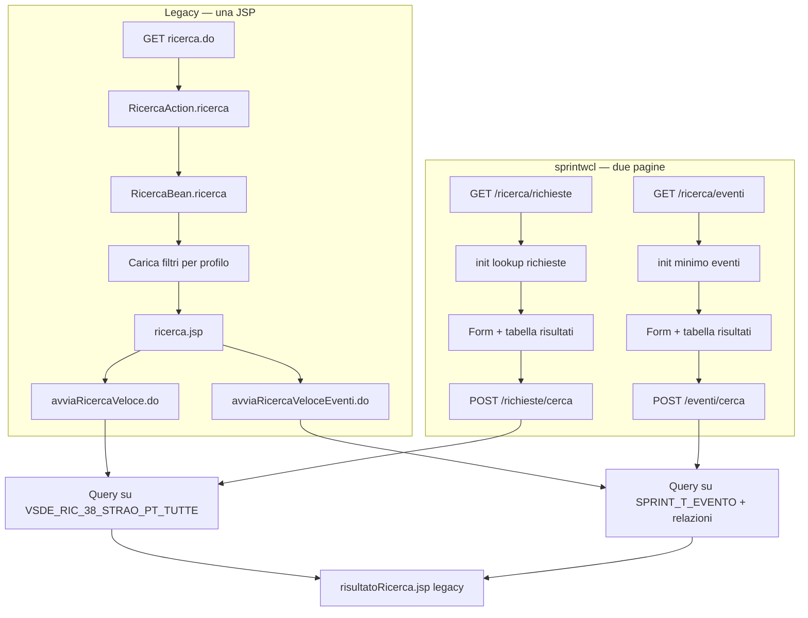

# Ricerca richieste ed eventi — analisi entità e proposta API

Documento di analisi per la migrazione del motore di ricerca legacy (`ricerca.do`) verso **due pagine Angular** distinte in `sprintwcl`, con API di dominio condivise in `sprintbff`.

| Pagina Angular (target) | Route suggerita | Sezione legacy | Submit legacy |
|------------------------|-----------------|----------------|---------------|
| **Ricerca richieste** | `/ricerca/richieste` | Ricerca veloce richiesta | `avviaRicercaVeloce.do` |
| **Ricerca eventi** | `/ricerca/eventi` | Ricerca veloce eventi | `avviaRicercaVeloceEventi.do` |

Il legacy espone un'unica JSP (`ricerca.jsp`) con due form sulla stessa schermata; in migrazione le due funzionalità sono **pagine separate** (menu, routing e init distinti), ma riusano le stesse API di dominio (`/leggi`, `/province`, …) dove applicabile.

**Fonti legacy (sola lettura):**

| Artefatto | Percorso |
|-----------|----------|
| Action Struts | `sprintj/.../RicercaAction.java` → metodo `ricerca()` |
| JSP | `sprintj/.../jsp/ricerca/ricerca.jsp` |
| Business | `sprintj/.../business/session/ricerca/RicercaBean.java` |
| DAO ricerca | `sprintj/.../integration/dao/ricerca/` |
| Config Struts | `sprintj/.../WEB-INF/struts-config-ricerca.xml` |

---

## 1. Cosa fa `ricerca.do` (legacy) e come si mappa in sprintwcl

`GET /ricerca.do` (parametro Struts `ricerca`) è il punto di ingresso legacy del **motore di ricerca**:

1. Pulisce la sessione di ricerca precedente.
2. Carica i **filtri** (dropdown e liste) in base al profilo utente (`ruolo@dominio`).
3. Renderizza `ricerca.jsp` con **due sezioni** sulla stessa pagina.

In `sprintwcl` ogni sezione diventa una **pagina autonoma**:

### Pagina Ricerca richieste (`/ricerca/richieste`)

- Form con tutti i filtri della sezione «Ricerca veloce richiesta» (provincia, comune, stato, legge, evento associato, date, compilatore, …).
- Submit → `POST /richieste/cerca` (equivalente `avviaRicercaVeloce.do`).
- Tabella risultati **paginata lato backend** (`page`, `pageSize` nel body; risposta `CercaRichiesteRisultatoPage`).

### Pagina Ricerca eventi (`/ricerca/eventi`)

- Form minimale: descrizione evento.
- Submit → `POST /eventi/cerca` (equivalente `avviaRicercaVeloceEventi.do`).
- Tabella risultati **paginata lato backend** (stesso contratto `CercaRisultatoPage` con `tipoOggetto = E`).

### Fuori scope pagine attuali (legacy commentato)

Ricerca predefinita e ricerca avanzata restano in fase 3 (`/motore-ricerca/*`); non fanno parte delle due pagine iniziali.

---

## 2. Diagramma flusso (due pagine + submit)



**Paginazione:** sia `POST /richieste/cerca` sia `POST /eventi/cerca` accettano `page` e `pageSize` e restituiscono `totale`, `pagina`, `totalePagine`, `items`. Il frontend **non** carica l'intero dataset in memoria: `mat-paginator` richiama l'API a ogni cambio pagina.

---

## 3. Entità coinvolte

### 3.1 Legenda colonne

| Colonna | Significato |
|---------|-------------|
| **Uso pagina** | Come compare in `ricerca.jsp` |
| **Origine dati** | DAO / servizio legacy |
| **Tabelle DB** | Oggetti Oracle toccati |
| **API proposta** | Endpoint REST riusabile (senza prefisso `/ricerca`) |

---

### 3.2 Filtri — ricerca veloce richieste

| Entità | Uso pagina | Origine dati | Tabelle DB | API proposta |
|--------|------------|--------------|------------|--------------|
| **Provincia** | Select `idProvinciaRicerca` | `RicercaTopeDAO.findAllProvincie()` — lista hardcoded Piemonte | — (nessuna tabella) | `GET /province` |
| **Comune** | Autocomplete `idSuggestComune` | `RicercaVeloceComune` servlet; in ricerca usa `all=true` → servizio LOTO `cercaComuni` | `VSDE_RIC_38_STRAO_PT_TUTTE` (modalità senza `all`) | `GET /comuni/suggest` |
| **Stato richiesta** | Select `idStatoRicerca` | `RicercaDAO.findAllStati()` | `SPRINT_D_RICHIESTA_GENERICA` (`NOME_COLONNA = 'FK_STATO'`) | `GET /richieste/stati` |
| **Legge** | Select `idLeggeRicerca` | `SprintMtdLeggeDAO.findAll()` | `SPRINT_MTD_LEGGE` | `GET /leggi` |
| **Evento associato** | Select `idEventoRicerca` | `RicercaDAO.findAllEventiStraordinari()` — filtrato per provincia se utente territoriale | `SPRINT_T_EVENTO`, `SPRINT_R_EVENTO_COMUNE` | `GET /eventi` (filtro `straordinario`) |
| **Codice richiesta** | Input testo `codiceRichiesta` | Filtro su vista al submit | `VSDE_RIC_38_STRAO_PT_TUTTE` | *(campo body in `POST /richieste/cerca`)* |
| **Data inserimento** | Date `dataEmissioneDal/Al` | Filtro al submit | `VSDE_RIC_38_STRAO_PT_TUTTE` | *(campo body)* |
| **Data modifica** | Date `dataModificaDal/Al` | Filtro al submit | `VSDE_RIC_38_STRAO_PT_TUTTE` | *(campo body)* |
| **Cognome compilatore** | Autocomplete `idSuggestCognome` | `RicercaVeloceCognome` → `RichiestaDAO.findAllCognomiCompilatore` | `VSDE_RIC_38_STRAO_PT_TUTTE` | `GET /richieste/compilatori/suggest` |
| **Dissesto senso PAI** | Select `flgDissenstoSensoPai` | Valori Si/No hardcoded in `RicercaAction` | — | enum frontend |
| **Provvedimento finanziamento** | Input testo | Filtro al submit | `VSDE_RIC_38_STRAO_PT_TUTTE` | *(campo body)* |
| **Ente richiedente** | Select `enteRichiedente` | `RichiestaDAO.findLkTipoAggregazione()` | `SPRINT_T_APPG_AGGREGAZIONI` | `GET /tipi-ente` |
| **Richiesta georiferita** | Select `flgRichiestaGeoriferita` | Valori Si/No hardcoded in `RicercaAction` | — | enum frontend |

---

### 3.3 Filtri — ricerca veloce eventi

| Entità | Uso pagina | Origine dati | Tabelle DB | API proposta |
|--------|------------|--------------|------------|--------------|
| **Evento** (risultato ricerca) | Input `descrizioneEvento` + risultati | `RicercaDAO` query eventi per descrizione | `SPRINT_T_EVENTO`, `SPRINT_D_EVENTO`, `SPRINT_R_EVENTO_COMUNE`, `SPRINT_T_AREA_IDRO`, `SPRINT_R_AREA_IDRO_EVENTO` | `POST /eventi/cerca` |

---

### 3.4 Metadati motore ricerca (caricati al load, UI avanzata disabilitata)

| Entità | Uso | Origine dati | Tabelle DB | API proposta |
|--------|-----|--------------|------------|--------------|
| **Ricerca predefinita** | Dropdown commentato `idRicercaPredefinita` | `RicercaDAO.findMtdRicercaPredByProfilo()` | `SPRINT_MTD_RICERCA_PRED_CLOB`, `SPRINT_MTD_PROFILO_UTENTE`, `SPRINT_MTD_R_PROFILO_RICERCA` | `GET /motore-ricerca/predefinite` |
| **Oggetto ricerca** | Lista oggetti ricerca avanzata | `RicercaDAO.findMtdOggettoByProfilo()` | `SPRINT_MTD_OGGETTO`, `SPRINT_MTD_R_OGG_PROF`, `SPRINT_MTD_PROFILO_UTENTE` | `GET /motore-ricerca/oggetti` |
| **Criterio ricerca** | Per oggetto selezionato | `RicercaDAO.findMtdCriterioByProfiloAndOggetto()` | `SPRINT_MTD_CRITERIO`, `SPRINT_MTD_R_CRITERIO_OGGPROF` | `GET /motore-ricerca/oggetti/{idOggetto}/criteri` |
| **Campo risultato ricerca** | Colonne tabella risultati | `RicercaDAO.findMtdCampoRisRicercaByProfiloAndOggetto()` | `SPRINT_MTD_CAMPO_RIS_RICERCA`, `SPRINT_MTD_R_CAMPO_OGGPROF` | `GET /motore-ricerca/oggetti/{idOggetto}/campi-risultato` |
| **Valori criterio** | Elenco valori per criterio | Dipende dal tipo criterio (lookup, date, …) | Varie (`SPRINT_D_*`, viste) | `GET /motore-ricerca/criteri/{idCriterio}/valori` |

---

### 3.5 Entità risultato (dopo submit)

| Entità | Descrizione | Tabelle principali | API proposta |
|--------|-------------|-------------------|--------------|
| **Richiesta** (item risultato) | Tabella JSP dinamica — vedi **§3.6** (30 colonne configurate in DB, 29 header visibili) | `VSDE_RIC_38_STRAO_PT_TUTTE` → `SPRINT_T_RIC_GENERICA`, `SPRINT_T_RIC_38_CALAMITA`, `SPRINT_R_RIC_GENERICA_COMUNE`, … | `POST /richieste/cerca` → `CercaRichiestaItemRisultato` |
| **Evento** (item risultato) | id, codEvento, descrizione, comuni, aree idro, date | `SPRINT_T_EVENTO` + relazioni | `POST /eventi/cerca` → `CercaItemRisultato` |

---

### 3.6 Tabella risultati JSP — ricerca veloce richieste

**JSP:** `sprintj/src/web/sprintj/jsp/ricerca/risultatoRicerca.jsp`  
**Submit:** `avviaRicercaVeloce.do` → forward `success` → stessa JSP per tutte le tipologie di ricerca.

#### Rendering JSP

| Elemento | Comportamento |
|----------|---------------|
| Tabella | `id="tabellaRisultatoRicerca"`, scroll orizzontale (`div.scroll.auto_orizz`) |
| Intestazioni | Iterate da `form.campiRicercaList` (session); testo = `descrizione`; escluse colonne con `flgPk=true` o `decorator='X'` |
| Colonna selezione | Checkbox `html:multibox property="index"` sulla colonna con `flgPk=true` (PK, header non visibile) |
| Celle | Formato per `decorator`: `S`/`L`/`SK` testo; `C` valuta `#,##0.00`; `D` data `dd/MM/yyyy`; `TC`/`TP` testo (comune/provincia risolti via LOTO in `compilaToponomastica`) |
| Paginazione | Sopra e sotto; per la veloce richieste usa `skipRicercaVeloce.do` (`defineVariable.jsp`) |
| Azioni | `pulsantiRicerca.jsp`: seleziona/deseleziona, visualizza dettaglio, mappa (solo se non `ricercaVeloceEventi`) |

#### Origine configurazione colonne

Metodo legacy: `RicercaDAOImpl.findCampoMtdRisRicercaVeloce()`  
Legge **3 righe** da `SPRINT_D_RICHIESTA_GENERICA` (valori comma-separated):

| `NOME_COLONNA` | Uso |
|----------------|-----|
| `FK_DESCR_CAMPO_RIS_RICERCA` | Etichetta header JSP |
| `FK_CAMPO_RIS_RICERCA` | Nome colonna SQL |
| `FK_DECORATOR` | Formato cella |

Per ogni indice `i`: `tabella = VSDE_RIC_38_STRAO_PT_TUTTE`, `flgPk = true` solo per `i == 0`.  
Query risultati: `RicercaUtil.buildSQLRicercaPredefinita()` + filtri da `RicercaAction.avviaRicercaVeloce()`.

#### Elenco colonne (DB PGSITTST)

| # | Header JSP | Campo SQL (`VSDE_RIC_38_STRAO_PT_TUTTE`) | Decorator | Note |
|---|------------|------------------------------------------|-----------|------|
| 0 | Chiave | `ID_RICHIESTA_GENERICA` | S | Solo checkbox (`flgPk`); header non visibile |
| 1 | Id richiesta | `COD_RICHIESTA` | S | |
| 2 | Legge | `FK_LEGGE` | L | Nome legge via `compilaLegge` |
| 3 | Stato | `STATO` | S | |
| 4 | Ente richiedente | `AGGREGAZIONI` | S | |
| 5 | Provincia | `ISTAT_PROVINCIA` | TP | Nome provincia via LOTO |
| 6 | Comune | `FK_TOPE_COMUNE` | TC | Nome comune via LOTO |
| 7 | Ordinanza-Provvedimento | `N_ORDINANZA_SINDACALE` | S | |
| 8 | Oggetto | `DESCRIZIONE_DANNO` | S | |
| 9 | Descrizione intervento | `DESCRIZIONE_INTERVENTO` | S | |
| 10 | Importo Somma Urgenza | `IMPORTO_SOMMA_URGENZA` | C | Valuta |
| 11 | Importo urgente | `IMPORTO_URGENTE` | C | Valuta |
| 12 | Importo definitivo | `IMPORTO_DEFINITIVO` | C | Valuta |
| 13 | Codice CUP | `CODICE_CUP` | S | |
| 14 | Coordinata X | `CO_X` | S | |
| 15 | Coordinata Y | `CO_Y` | S | |
| 16 | Data inserimento | `DATA_INSERIMENTO` | D | |
| 17 | Data ultima modifica | `MOD_DATA` | D | |
| 18 | Compilatore | `COGNOME_COMPILATORE` | S | |
| 19 | Classe_rischio | `CLASSE_RISCHIO` | S | |
| 20 | Descrizione_evento | `DESCRIZIONE` | S | Descrizione evento associato (colonna vista) |
| 21 | Note_aggiuntive_danno | `NOTE` | S | |
| 22 | Categoria_danno | `CODICE` | S | |
| 23 | Sottocategoria_danno | `SOTTOCATEGORIA` | S | |
| 24 | Descrizione_dissesto | `DESCRIZIONE_DISSESTO` | S | |
| 25 | Dissesto_PAI | `DISSESTO_SENSO_PAI` | S | SI/NO (CASE in vista) |
| 26 | Tipo_dissesto | `DESCRIZIONE_TIPO_DISSESTO` | S | |
| 27 | Località | `LOCALITA` | S | |
| 28 | Provv. Finanziamento | `PROVVEDIMENTO_FINANZIAMENTO` | S | |
| 29 | Rich. Georiferita | `GEORIFERITO` | S | SI/NO (CASE in vista) |

**Header visibili:** 29 (tutte tranne «Chiave», che è solo checkbox).

#### Mapping API (`CercaRichiestaItemRisultato`)

Lo schema OpenAPI in `openapi.yaml` espone gli stessi campi in camelCase. I decorator `L`, `TC`, `TP` corrispondono a valori già risolti lato BFF (`nomeLegge`, `descrizioneProvincia`, `descrizioneComune`).

---

### 3.7 Composizione colonne per ruolo/profilo

Domanda chiave: **le colonne della tabella risultati dipendono dal ruolo utente?**

| | Ricerca **veloce** richieste | Ricerca **avanzata** / **predefinita** |
|---|---|---|
| Submit legacy | `avviaRicercaVeloce.do` | motore ricerca (`/motore-ricerca/*`) |
| Colonne dipendono dal ruolo? | **NO — elenco fisso, uguale per tutti** | **SÌ — colonne per profilo** |
| Metodo DAO | `findCampoMtdRisRicercaVeloce()` (nessun parametro) | `findCampoMtdRisRicercaByProfiloAndOggetto(idOggetto, profilo)` / `...ByProfiloAndRicPred(idRicPred, profilo)` |
| Fonte colonne | `SPRINT_D_RICHIESTA_GENERICA` (3 righe di config statica) | `SPRINT_MTD_CAMPO_RIS_RICERCA` + relazioni profilo |
| Ordine colonne | ordine dei token nella config | colonna `ORDINE` della relazione profilo↔campo |

**Risposta:** la **ricerca veloce richieste** (quella migrata in `/ricerca/richieste`) ha **colonne fisse, identiche per ogni ruolo**. Il meccanismo «colonne per profilo» **esiste** nel legacy ma riguarda **solo la ricerca avanzata e le ricerche predefinite** (fase 3), non la ricerca veloce.

#### Ricerca veloce — colonne fisse (nessun ruolo)

Il metodo che alimenta `campiRicercaList` ha firma **senza parametri**: non riceve nemmeno il profilo.

```java
// integration/dao/ricerca/IRicercaDAO.java:99
public Collection findCampoMtdRisRicercaVeloce() throws DAOException;
```

```java
// integration/dao/ricerca/impl/RicercaDAOImpl.java:1695-1777
public Collection findCampoMtdRisRicercaVeloce() throws DAOException {
    // TABELLA_RICERCA_VELOCE = "VSDE_RIC_38_STRAO_PT_TUTTE"  (:1693)
    query = "select DESCRIZIONE from SPRINT_D_RICHIESTA_GENERICA where NOME_COLONNA = 'FK_DESCR_CAMPO_RIS_RICERCA'"; // :1711 → header
    query = "select DESCRIZIONE from SPRINT_D_RICHIESTA_GENERICA where NOME_COLONNA = 'FK_CAMPO_RIS_RICERCA'";        // :1717 → campo SQL
    query = "select DESCRIZIONE from SPRINT_D_RICHIESTA_GENERICA where NOME_COLONNA = 'FK_DECORATOR'";                // :1723 → decorator
    // obj.setTabella(TABELLA_RICERCA_VELOCE);  flgPk = true solo per i == 0  (:1750)
}
```

Catena: `RicercaAction.avviaRicercaVeloce()` (`:2233-2570`) → `ricercaBD.avviaRicercaVeloce(dto, fec)` (`:2541`) → `RicercaBean.avviaRicercaVeloce(...)` → `findCampoMtdRisRicercaVeloce()` (`RicercaBean.java:724`) → `form.setCampiRicercaList(...)` (`:2555`).

> Il `profilo` (`ruolo@dominio`, da `FrontEndContext`) **viene passato** a `RicercaBean.avviaRicercaVeloce(...)`, ma è usato solo per filtrare i **dati** (visibilità/aggregazione territoriale), **non** per comporre le colonne.

#### Ricerca avanzata / predefinita — colonne per profilo

Solo qui le colonne sono scelte e ordinate per profilo, leggendo dalle tabelle metadati `SPRINT_MTD_*`:

```java
// RicercaDAOImpl.java:601-658  (ricerca avanzata, per oggetto + profilo)
"from SPRINT_MTD_CAMPO_RIS_RICERCA c, SPRINT_MTD_R_CAMPO_OGGPROF r, SPRINT_MTD_PROFILO_UTENTE p " +
"where c.ID_CAMPO_RIS_RICERCA = r.ID_CAMPO_RIS_RICERCA and p.ID_PROFILO = r.ID_PROFILO " +
"and r.ID_OGGETTO = ? and p.DENOMINAZIONE = ? order by r.ORDINE";   // DENOMINAZIONE = ruolo@dominio
```

```java
// RicercaDAOImpl.java:660-718  (ricerca predefinita, per ricerca pred. + profilo)
"from SPRINT_MTD_CAMPO_RIS_RICERCA c, SPRINT_MTD_R_CAMPO_RICERCAPRED r, " +
"     SPRINT_MTD_PROFILO_UTENTE p, SPRINT_MTD_R_PROFILO_RICERCA pr " +
"where ... and pr.ID_RICERCA_PRED = r.ID_RICERCA_PRED and r.ID_RICERCA_PRED = ? " +
"and p.DENOMINAZIONE = ? order by r.ORDINE";
```

| Tabella | Ruolo |
|---------|-------|
| `SPRINT_MTD_CAMPO_RIS_RICERCA` | catalogo campi-colonna disponibili (descrizione, decorator, …) |
| `SPRINT_MTD_R_CAMPO_OGGPROF` | relazione campo ↔ (oggetto, profilo) + `ORDINE` (avanzata) |
| `SPRINT_MTD_R_CAMPO_RICERCAPRED` | relazione campo ↔ ricerca predefinita + `ORDINE` |
| `SPRINT_MTD_PROFILO_UTENTE` | profili utente; chiave logica `DENOMINAZIONE = ruolo@dominio` |
| `SPRINT_MTD_R_PROFILO_RICERCA` | relazione profilo ↔ ricerca predefinita |

#### Implicazioni per la migrazione

- **`/ricerca/richieste`:** la ricerca dati resta su `POST /richieste/cerca` (vista `VSDE_RIC_38_STRAO_PT_TUTTE`, set completo `CercaRichiestaItemRisultato`, §3.6). La **composizione delle colonne visibili** è invece servita per profilo dal BFF (vedi sotto), e l'utente può ulteriormente personalizzare la visibilità **lato frontend** (popup colonne + `sessionStorage`, skill `table-columns`).
- **Colonne per profilo (implementato):** `GET /richieste/colonne-risultato` (`RicercaManager.getColonneRisultatoRichieste`) legge le colonne per il profilo corrente (`ruolo@dominio`) dall'oggetto legacy **"Tutte le richieste"** via `SPRINT_MTD_CAMPO_RIS_RICERCA` + `SPRINT_MTD_R_CAMPO_OGGPROF` + `SPRINT_MTD_OGGETTO` + `SPRINT_MTD_PROFILO_UTENTE` (ordine da `ORDINE`). Le colonne avanzate prive di corrispondenza nella vista quick-search (es. *Aree Idrografiche*, *Importo richiesto*) sono escluse con log; se il profilo non ha configurazione si ritorna il set di default (§3.6). Il frontend consuma questo endpoint al posto dell'elenco hardcoded.
- **Ricerca avanzata/predefinita completa:** resta fase 3 (`GET /motore-ricerca/oggetti/{idOggetto}/campi-risultato`, §4.5) — l'esecuzione della query avanzata richiede il porting dell'SQL Oracle (`CONNECT BY`, `sys_connect_by_path`) degli oggetti `SPRINT_MTD_OGGETTO.appg_from`.

---

## 4. Proposta API Swagger (bozza)

Contratto target: `sprintbff/src/main/resources/static/api/openapi.yaml`

### 4.0 Principio di naming

Le API sono organizzate per **risorsa di dominio**, non per pagina. Così gli stessi endpoint servono ricerca, nuova richiesta, eventi, mappa, ecc.

| Livello | Prefisso path | Esempio | Quando usarlo |
|---------|---------------|---------|---------------|
| **Dominio** | nessuno (risorsa radice) | `/leggi`, `/province`, `/richieste/stati` | Lookup e CRUD riusabili ovunque |
| **Azione su risorsa** | sotto-risorsa della entità | `POST /richieste/cerca`, `POST /eventi/cerca` | Ricerca / operazioni specifiche del dominio |
| **Motore ricerca** | `/motore-ricerca` | `/motore-ricerca/oggetti` | Solo metadati del query builder (oggetti, criteri, predefinite) |
| **Composizione pagina** *(opzionale)* | `/pagine/{nome}` | `GET /pagine/ricerca-richieste/init`, `GET /pagine/ricerca-eventi/init` | Aggregato BFF per init di **una** schermata; non sostituisce le API di dominio |

**Tag OpenAPI suggeriti:** `Territorio`, `Leggi`, `Enti`, `Richieste`, `Eventi`, `MotoreRicerca`

**Paginazione (obbligatoria per tabelle dati):**

| Livello | Regola |
|---------|--------|
| **API** | Endpoint che restituiscono elenchi tabellari espongono `page` e `pageSize` (query o body) e rispondono con `totale`, `pagina`, `totalePagine`, `items` (schema tipo `CercaRisultatoPage` o equivalente riusabile) |
| **BFF** | `LIMIT`/`OFFSET` (o equivalente) in SQL; mai restituire l'intero dataset quando la UI è una tabella |
| **Frontend** | `mat-table` + `mat-paginator`: ogni cambio pagina/dimensione richiama l'API; **vietata** paginazione client-side su array completi |

Lookup piccoli (province, stati, leggi per select) possono restare array non paginati; le **tabelle di risultato** no.

**Riutilizzo atteso:**

| API | Altre sezioni che la useranno |
|-----|------------------------------|
| `GET /leggi` | Nuova richiesta, dettaglio, filtri report |
| `GET /province`, `GET /comuni/suggest` | Mappa, inserimento richiesta, eventi |
| `GET /richieste/stati` | Workflow richiesta, liste, dashboard |
| `GET /tipi-ente` | Form richiesta, associazioni |
| `GET /eventi` | Associazione evento–richiesta, filtri |
| `POST /richieste/cerca` | Ricerca, export, selezione multipla |

---

```yaml
components:
  schemas:
    LookupItem:
      type: object
      properties:
        codice:
          type: string
          description: Valore da inviare nei filtri (id, codice ISTAT, ecc.)
        descrizione:
          type: string
      required: [codice, descrizione]

    LeggeItem:
      type: object
      properties:
        idLegge:
          type: integer
        nomeLegge:
          type: string
        codice:
          type: string
          nullable: true

    TipoEnteItem:
      type: object
      properties:
        idTipoaggr:
          type: integer
        tipoAggr:
          type: string

    OggettoRicercaItem:
      type: object
      properties:
        idOggetto:
          type: integer
        alias:
          type: string
        tipoOggetto:
          type: string
          description: "R = richiesta, E = evento"
        legge:
          type: integer
          nullable: true
        stato:
          type: integer
          nullable: true

    RicercaPredefinitaItem:
      type: object
      properties:
        idRicercaPred:
          type: integer
        titoloRicerca:
          type: string
        tipoOggetto:
          type: string

    CercaRichiesteRequest:
      type: object
      properties:
        provincia:
          type: string
          description: Codice ISTAT provincia
        comune:
          type: string
          description: Id toponimo comune (da suggest)
        codiceRichiesta:
          type: string
        stato:
          type: string
        legge:
          type: integer
        evento:
          type: integer
        dataInserimentoDal:
          type: string
          format: date
        dataInserimentoAl:
          type: string
          format: date
        dataModificaDal:
          type: string
          format: date
        dataModificaAl:
          type: string
          format: date
        cognomeCompilatore:
          type: string
        flgDissestoSensoPai:
          type: string
          enum: ["0", "1"]
        provvedimentoFinanziamento:
          type: string
        enteRichiedente:
          type: integer
        flgRichiestaGeoriferita:
          type: string
          enum: ["0", "1"]
        page:
          type: integer
          default: 1
        pageSize:
          type: integer
          default: 20

    CercaEventiRequest:
      type: object
      properties:
        descrizione:
          type: string
        page:
          type: integer
          default: 1
        pageSize:
          type: integer
          default: 20

    CercaItemRisultato:
      type: object
      description: Item risultato ricerca eventi (e motore ricerca generico)
      properties:
        id:
          type: string
        codice:
          type: string
        descrizione:
          type: string
        stato:
          type: string
          nullable: true
        descrizioneComune:
          type: string
          nullable: true
        tipoGeometria:
          type: string
          nullable: true

    CercaRichiestaItemRisultato:
      type: object
      description: |
        Item risultato ricerca veloce richieste — parità colonne legacy
        (risultatoRicerca.jsp + findCampoMtdRisRicercaVeloce, §3.6).
      properties:
        idRichiestaGenerica:
          type: string
          description: PK (colonna checkbox legacy)
        codRichiesta:
          type: string
        nomeLegge:
          type: string
          nullable: true
        stato:
          type: string
          nullable: true
        enteRichiedente:
          type: string
          nullable: true
        descrizioneProvincia:
          type: string
          nullable: true
        descrizioneComune:
          type: string
          nullable: true
        nOrdinanzaSindacale:
          type: string
          nullable: true
        descrizioneDanno:
          type: string
          nullable: true
        descrizioneIntervento:
          type: string
          nullable: true
        importoSommaUrgenza:
          type: number
          format: double
          nullable: true
        importoUrgente:
          type: number
          format: double
          nullable: true
        importoDefinitivo:
          type: number
          format: double
          nullable: true
        codiceCup:
          type: string
          nullable: true
        coX:
          type: number
          format: double
          nullable: true
        coY:
          type: number
          format: double
          nullable: true
        dataInserimento:
          type: string
          format: date
          nullable: true
        modData:
          type: string
          format: date
          nullable: true
        cognomeCompilatore:
          type: string
          nullable: true
        classeRischio:
          type: string
          nullable: true
        descrizioneEvento:
          type: string
          nullable: true
        note:
          type: string
          nullable: true
        categoriaDanno:
          type: string
          nullable: true
        sottocategoriaDanno:
          type: string
          nullable: true
        descrizioneDissesto:
          type: string
          nullable: true
        dissestoSensoPai:
          type: string
          nullable: true
        descrizioneTipoDissesto:
          type: string
          nullable: true
        localita:
          type: string
          nullable: true
        provvedimentoFinanziamento:
          type: string
          nullable: true
        georiferito:
          type: string
          nullable: true

    CercaRisultatoPage:
      type: object
      properties:
        tipoOggetto:
          type: string
          enum: [R, E]
        totale:
          type: integer
        pagina:
          type: integer
        totalePagine:
          type: integer
        items:
          type: array
          items:
            $ref: '#/components/schemas/CercaItemRisultato'

    CercaRichiesteRisultatoPage:
      type: object
      properties:
        totale:
          type: integer
        pagina:
          type: integer
        totalePagine:
          type: integer
        items:
          type: array
          items:
            $ref: '#/components/schemas/CercaRichiestaItemRisultato'

    PaginaRicercaRichiesteInitResponse:
      type: object
      description: |
        Aggregato opzionale per inizializzare la pagina /ricerca/richieste con una sola chiamata.
        Compone le API di dominio già esposte singolarmente.
      properties:
        province:
          type: array
          items:
            $ref: '#/components/schemas/LookupItem'
        statiRichiesta:
          type: array
          items:
            $ref: '#/components/schemas/LookupItem'
        leggi:
          type: array
          items:
            $ref: '#/components/schemas/LeggeItem'
        eventi:
          type: array
          items:
            $ref: '#/components/schemas/LookupItem'
        tipiEnte:
          type: array
          items:
            $ref: '#/components/schemas/TipoEnteItem'

    PaginaRicercaEventiInitResponse:
      type: object
      description: |
        Aggregato opzionale per inizializzare la pagina /ricerca/eventi.
        La pagina eventi non richiede i lookup della ricerca richieste.
      properties: {}
```

---

### 4.2 Endpoint — lookup di dominio (riusabili)

API granulari da preferire: ogni sezione dell'app le importa direttamente.

| Metodo | Path | operationId | Tag | Tabelle |
|--------|------|-------------|-----|---------|
| GET | `/province` | `getProvince` | Territorio | — |
| GET | `/richieste/stati` | `getRichiesteStati` | Richieste | `SPRINT_D_RICHIESTA_GENERICA` |
| GET | `/leggi` | `getLeggi` | Leggi | `SPRINT_MTD_LEGGE` |
| GET | `/eventi` | `getEventi` | Eventi | `SPRINT_T_EVENTO`, `SPRINT_R_EVENTO_COMUNE` |
| GET | `/tipi-ente` | `getTipiEnte` | Enti | `SPRINT_T_APPG_AGGREGAZIONI` |

`GET /eventi` — parametri query per il dropdown filtro nella pagina ricerca richieste (riusabile anche altrove):

```yaml
  /eventi:
    get:
      tags: [Eventi]
      summary: Elenco eventi (lookup)
      operationId: getEventi
      parameters:
      - name: straordinario
        in: query
        schema:
          type: boolean
        description: true = solo eventi straordinari (default in ricerca.do)
      - name: provincia
        in: query
        schema:
          type: string
        description: Codice ISTAT; se assente usa il contesto utente
      responses:
        "200":
          description: Eventi per select/autocomplete
          content:
            application/json:
              schema:
                type: array
                items:
                  $ref: '#/components/schemas/LookupItem'
      security:
      - basicAuth: []
```

#### Opzione aggregata — init per pagina (due endpoint)

Composizione BFF che chiama internamente le API di dominio. **Non** sostituisce gli endpoint granulari. Una pagina Angular → un endpoint init (se si usa l'aggregato).

```yaml
  /pagine/ricerca-richieste/init:
    get:
      tags: [MotoreRicerca]
      summary: Dati iniziali pagina ricerca richieste
      description: |
        Equivalente del load filtri per la sezione richieste di `ricerca.do`.
        Aggrega province, stati, leggi, eventi (lookup), tipi ente.
      operationId: getPaginaRicercaRichiesteInit
      responses:
        "200":
          description: Dati per inizializzare /ricerca/richieste
          content:
            application/json:
              schema:
                $ref: '#/components/schemas/PaginaRicercaRichiesteInitResponse'
      security:
      - basicAuth: []

  /pagine/ricerca-eventi/init:
    get:
      tags: [MotoreRicerca]
      summary: Dati iniziali pagina ricerca eventi
      description: |
        Init minimo per /ricerca/eventi. Opzionale: il frontend può aprire
        la pagina senza lookup e invocare direttamente POST /eventi/cerca.
      operationId: getPaginaRicercaEventiInit
      responses:
        "200":
          description: Dati per inizializzare /ricerca/eventi
          content:
            application/json:
              schema:
                $ref: '#/components/schemas/PaginaRicercaEventiInitResponse'
      security:
      - basicAuth: []
```

---

### 4.3 Endpoint — autocomplete

```yaml
  /comuni/suggest:
    get:
      tags: [Territorio]
      summary: Suggerimenti comune
      operationId: suggestComuni
      parameters:
      - name: testo
        in: query
        required: true
        schema:
          type: string
          minLength: 1
      - name: provincia
        in: query
        required: false
        schema:
          type: string
          description: Codice ISTAT provincia
      - name: soloConRichieste
        in: query
        schema:
          type: boolean
          default: false
        description: |
          false = tutti i comuni (LOTO, come all=true in legacy);
          true = solo comuni presenti in VSDE_RIC_38_STRAO_PT_TUTTE
      responses:
        "200":
          description: Lista suggerimenti (max 5-6)
          content:
            application/json:
              schema:
                type: array
                items:
                  $ref: '#/components/schemas/LookupItem'
      security:
      - basicAuth: []

  /richieste/compilatori/suggest:
    get:
      tags: [Richieste]
      summary: Suggerimenti cognome compilatore
      operationId: suggestRichiesteCompilatori
      parameters:
      - name: testo
        in: query
        required: true
        schema:
          type: string
          minLength: 1
      responses:
        "200":
          description: Cognomi distinti
          content:
            application/json:
              schema:
                type: array
                items:
                  $ref: '#/components/schemas/LookupItem'
      security:
      - basicAuth: []
```

**Mapping DB autocomplete:**

| Endpoint | Tabelle |
|----------|---------|
| `suggestComuni` (soloConRichieste=true) | `VSDE_RIC_38_STRAO_PT_TUTTE` |
| `suggestComuni` (soloConRichieste=false) | Servizio esterno LOTO (da valutare integrazione BFF) |
| `suggestRichiesteCompilatori` | `VSDE_RIC_38_STRAO_PT_TUTTE` |

---

### 4.4 Endpoint — esecuzione ricerca

Azione `cerca` sotto la risorsa di dominio: stesso contratto usabile da ricerca, report, export, ecc.

```yaml
  /richieste/cerca:
    post:
      tags: [Richieste]
      summary: Cerca richieste
      description: Equivalente di `avviaRicercaVeloce.do`
      operationId: cercaRichieste
      requestBody:
        required: true
        content:
          application/json:
            schema:
              $ref: '#/components/schemas/CercaRichiesteRequest'
      responses:
        "200":
          description: Pagina risultati
          content:
            application/json:
              schema:
                $ref: '#/components/schemas/CercaRichiesteRisultatoPage'
        "400":
          $ref: '#/components/responses/InvalidParameter'
        "403":
          $ref: '#/components/responses/Forbidden'
        default:
          description: errore generico
          content:
            application/json:
              schema:
                $ref: '#/components/schemas/Errore'
      security:
      - basicAuth: []

  /eventi/cerca:
    post:
      tags: [Eventi]
      summary: Cerca eventi
      description: Equivalente di `avviaRicercaVeloceEventi.do`
      operationId: cercaEventi
      requestBody:
        required: true
        content:
          application/json:
            schema:
              $ref: '#/components/schemas/CercaEventiRequest'
      responses:
        "200":
          description: Pagina risultati
          content:
            application/json:
              schema:
                $ref: '#/components/schemas/CercaRisultatoPage'
      security:
      - basicAuth: []
```

**Mapping DB ricerca:**

| Endpoint | Tabelle / viste |
|----------|-----------------|
| `cercaRichieste` | `VSDE_RIC_38_STRAO_PT_TUTTE` (vista aggregata; sottostanti `SPRINT_T_RIC_GENERICA`, `SPRINT_T_RIC_38_CALAMITA`, `SPRINT_R_RIC_GENERICA_COMUNE`, `SPRINT_D_RICHIESTA_GENERICA`, …) |
| `cercaEventi` | `SPRINT_T_EVENTO`, `SPRINT_D_EVENTO`, `SPRINT_R_EVENTO_COMUNE`, `SPRINT_T_AREA_IDRO`, `SPRINT_R_AREA_IDRO_EVENTO` |

---

### 4.5 Endpoint — motore ricerca avanzata (fase 2)

Prefisso `/motore-ricerca` solo per i metadati del query builder, non per le entità di dominio.

```yaml
  /motore-ricerca/oggetti:
    get:
      tags: [MotoreRicerca]
      operationId: getMotoreRicercaOggetti
      responses:
        "200":
          description: Oggetti di ricerca per profilo utente
      security:
      - basicAuth: []

  /motore-ricerca/predefinite:
    get:
      tags: [MotoreRicerca]
      operationId: getMotoreRicercaPredefinite
      responses:
        "200":
          description: Ricerche predefinite per profilo utente
      security:
      - basicAuth: []

  /motore-ricerca/oggetti/{idOggetto}/criteri:
    get:
      tags: [MotoreRicerca]
      operationId: getMotoreRicercaCriteriByOggetto
      parameters:
      - name: idOggetto
        in: path
        required: true
        schema:
          type: integer
      responses:
        "200":
          description: Criteri disponibili per l'oggetto e il profilo utente
      security:
      - basicAuth: []

  /motore-ricerca/esecuzione:
    post:
      tags: [MotoreRicerca]
      summary: Esecuzione ricerca avanzata
      operationId: eseguiMotoreRicerca
      requestBody:
        required: true
        content:
          application/json:
            schema:
              type: object
              properties:
                idOggetto:
                  type: integer
                condizioni:
                  type: array
                  items:
                    type: object
                    properties:
                      idCriterio:
                        type: integer
                      operatore:
                        type: string
                        enum: ['=', '<>', '<', '>', '<=', '>=']
                      valore:
                        type: string
                      connettore:
                        type: string
                        enum: [AND, OR]
                page:
                  type: integer
                pageSize:
                  type: integer
      responses:
        "200":
          description: Risultati
          content:
            application/json:
              schema:
                $ref: '#/components/schemas/CercaRisultatoPage'
      security:
      - basicAuth: []

  /motore-ricerca/predefinite/{id}/esecuzione:
    post:
      tags: [MotoreRicerca]
      summary: Esegue una ricerca predefinita
      operationId: eseguiMotoreRicercaPredefinita
      parameters:
      - name: id
        in: path
        required: true
        schema:
          type: integer
      responses:
        "200":
          description: Risultati
          content:
            application/json:
              schema:
                $ref: '#/components/schemas/CercaRisultatoPage'
      security:
      - basicAuth: []
```

---

## 5. Priorità implementazione suggerita

| Fase | Deliverable | Motivazione |
|------|-------------|-------------|
| **1** | `GET /province`, `/richieste/stati`, `/leggi`, `/eventi`, `/tipi-ente` | Lookup riusabili — sbloccano pagina richieste e altre sezioni |
| **1** | `GET /comuni/suggest`, `GET /richieste/compilatori/suggest` | Autocomplete (anche nuova richiesta, mappa) |
| **1** *(opz.)* | `GET /pagine/ricerca-richieste/init` | Init aggregato pagina richieste; opzionale se il frontend compone i lookup |
| **2** | `POST /richieste/cerca` + pagina `/ricerca/richieste` | Core business — ricerca veloce richieste con tabella paginata backend |
| **2** | `POST /eventi/cerca` + pagina `/ricerca/eventi` | Ricerca eventi — pagina separata, stesso pattern di paginazione |
| **3** | `/motore-ricerca/*` | Ricerca avanzata/predefinita legacy; eventuale terza pagina o modale |

---

## 6. Note tecniche per l'implementazione BFF

1. **Profilo utente**: molte liste sono filtrate per `ruolo@dominio` e provincia ISTAT dell'utente (`FrontEndContext`). Le API devono leggere lo stesso contesto da Iride/header già usato dal BFF.

2. **Vista `VSDE_RIC_38_STRAO_PT_TUTTE`**: cuore della ricerca veloce richieste. Valutare se esporre una view dedicata o replicare la query nel Manager senza concatenazione SQL dinamica (il legacy costruisce stringhe SQL in `RicercaAction.avviaRicercaVeloce` — **da evitare** nel nuovo stack; usare query parametrizzate).

3. **LOTO / comuni**: con `all=true` il legacy non interroga Oracle ma il servizio `CommonBusinessDelegate.cercaComuni`. Decidere se integrare LOTO nel BFF o limitarsi ai comuni con richieste.

4. **Province hardcoded**: oggi sono 8 province del Piemonte in codice Java. In migrazione si può mantenere il comportamento o spostare su tabella/vista toponomica.

5. **Si/No statici**: `flgDissestoSensoPai` e `flgRichiestaGeoriferita` non richiedono API dedicate.

6. **Paginazione tabelle**: ogni `mat-table` di risultati usa `mat-paginator` collegato ai parametri `page` / `pageSize` dell'API e al `totale` in risposta. Vietato paginare lato client su dataset completi.

7. **Risultati e azioni successive**: `risultatoRicerca.jsp` supporta invio multiplo richieste, mappa, Excel, dettaglio (`visualizzaDettaglioRicerca.do`). Sono **fuori scope** di questo documento ma dipendono dalle stesse entità Richiesta/Evento.

---

## 7. Prossimi passi

- [ ] Creare in `sprintwcl` due route/feature: `ricerca-richieste` e `ricerca-eventi` (menu e navigazione distinti)
- [ ] Validare se il frontend compone i lookup (`/leggi`, `/province`, …) o usa `GET /pagine/ricerca-richieste/init`
- [ ] Trasferire gli schemi YAML in `openapi.yaml` (fase 1), inclusi `page`/`pageSize` su ogni endpoint lista
- [ ] Aggiornare `schema/api-tables.md` per ogni endpoint che tocca il DB
- [ ] Implementare i Manager di dominio in `sprintbff` (`LeggiManager`, `RichiesteManager`, `EventiManager`, …) invece di un unico `RicercaManager` monolitico
- [ ] Tabelle risultato con `mat-paginator` → richiamo API a ogni cambio pagina (paginazione backend)
